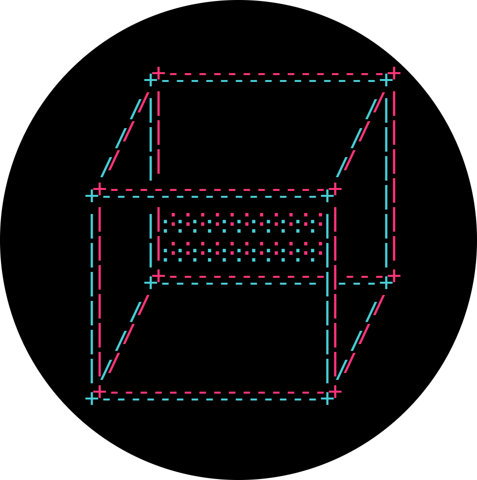
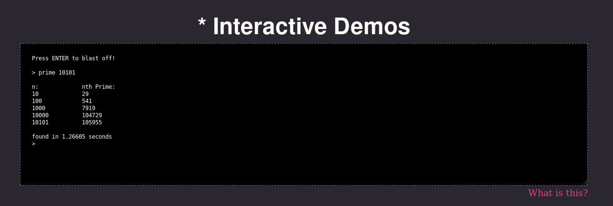

# demo



A fake terminal cleans up user input and sends it to the server. The server then parses the input, and if it matches a predefined command, spawns a child process of that command/program. I really liked the ability to try out haskell interactively [here](https://www.haskell.org/) and [here](https://tryhaskell.org/), so this is something like that.

Try it out [here](https://liambeckman.com/code/demo).

<a href="https://liambeckman.com/code/demo">
    
</a>

# installation and running

```sh
# install dependencies
npm install

# copy example config
cp config-example.js config.js

# edit key, certificate, and passphrase information
nano config.js

# run server (if no port number is provided, 12345 in this example, the server will default to port 8181)
node server.js 12345

# edit server information
nano demo.js

# then you can connect to the server from a client (e.g. client-example.html) 
```

# uninstallation

```sh
# remove this directory
rm -rfI demo
```
