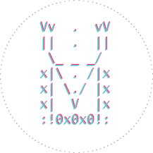
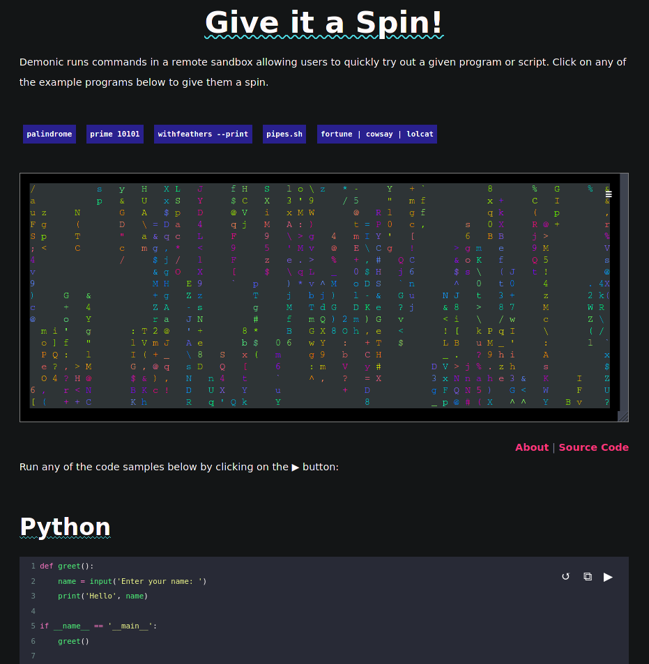

# demonic-server

The backend for a web-based terminal to run commands and code snippets in a sandboxed environment.

Try it out at [liambeckman.com/code/demonic](https://liambeckman.com/code/demonic).

[](https://liambeckman.com/code/demonic)

## Inspired By

Demonic was inspired by the following cool projects:

- [Rust Playground](https://play.rust-lang.org/)
- [Try Haskell!](https://www.tryhaskell.org/)
- [Repl.it](https://repl.it/languages/c)

# Installation

```sh
# get code
git clone https://github.com/lbeckman314/demonic-server
cd demonic-server

# install dependencies
npm install

# copy example config
cp src/config-example.js src/config.js

# edit key, certificate, and passphrase information
vim src/config.js

# run server (if no port number is provided, 12345 in this example, the server will default to port 8181)
npm run start -- 12345

# then you can connect to the server from a demonic client.
```

# Uninstallation

```sh
# remove this directory
rm -rf demonic-server
```

# Message Protocol

1) Connection is established between **client** and **server**. **Client** displays user prompt.

```
user @ demonic >
```

2) **Client** sends user input to the **server**.

```
user @ demonic > echo "Wow, I'm in a shell!"\n
```

4) **Server** searches for `echo` in the list of allowed programs. If found, **server** spawns the `echo` process.

5) **Server** sends **client** the output of the command.

```json
{ out: "Wow, I'm in a shell!" }
```

6) **Client** displays output of the command to the user.

```
user @ demonic > echo "Wow, I'm in a shell!"\n
Wow, I'm in a shell!
```

7) **Server** sends **client** the exit status of the command.

```json
{ exit: 0 }
```

- **Client** displays user prompt on terminal. Ready for next command!

```
user @ demonic >
```

## Client to Server

| Keyword | Data Type | Description                                                         | Example                            |
| -       | -         | -                                                                   | -                                  |
| `data`  | String    | The commands or code sent by the user to be evaulted by the server. | `print("Wow, I'm in a language!")` |
| `lang`  | String    | What programming language to compile or interpret `data`. Stops any program or snippet this connection is already running. | `python`                           |
| `resize` | Object   | New terminal size, `{cols, rows}`. Resizes the running program's terminal (so full-screen programs redraw) and sets the size for programs started later. Clients should also send `data: ""` so servers that predate `resize` ignore the message. | `{"cols": 120, "rows": 40}` |
| `cols`, `rows` | Number | Terminal size, sent with other messages by older clients. Treated like `resize`. | `80`, `24` |

## Server to Client

| Keyword   | Data Type | Description                                                                      | Example                                          |
| -         | -         | -                                                                                | -                                                |
| `exit`    | Number    | Exit status of spawned process.                                                  | `0`                                              |
| `draw`    | Boolean   | Informs client that spawned process will handle output of characters (e.g. vim). | `false`                                          |
| `out`     | String    | STDOUT of the spawned process.                                                   | `Wow, I'm in a language!`                        |
| `err`     | String    | STDERR of the spawned process.                                                   | `SyntaxError: EOL while scanning string literal` |
| `loading` | Boolean   | Informs client that process is ongoing and output is forthcoming.                | `true`                                           |
| `meta`    | Object    | Attribution for the program that is starting: `name`, plus whichever of `author`, `url` and `license` its `process.yaml` entry sets. Only sent when at least one is set. Applies until the next `exit`. | `{"name": "pokeductor", "author": "Huseyn Teymurzade", "url": "https://github.com/Huseynteymurzade28/pokeductor", "license": "MIT"}` |

# Security Model

Every command runs inside a [Firejail](https://firejail.wordpress.com/) sandbox, and **Firejail is the only security boundary**. The program and language names in `src/process.yaml` decide what the prompt accepts, but they are not an allowlist: `bash` is available, and anything after `&&`, `$(...)` or backticks runs too. Assume a visitor can run any binary in the chroot.

By default each sandbox gets:

| Firejail option                    | Effect                                                   |
| -                                  | -                                                        |
| `--chroot=/srv/chroot`             | Debian root filesystem, separate from the server's.      |
| `--private`, `--private-tmp`, `--private-dev` | Empty, throwaway home directory, `/tmp` and `/dev`.  |
| `--net=none`                       | No network interfaces except loopback (see [Network Access](#network-access) for programs that opt in). |
| `--noroot`, `--caps.drop=all`      | No root user and no capabilities.                        |
| `--seccomp`, `--nonewprivs`        | Default syscall filter; setuid binaries cannot gain privileges. |
| `--rlimit-nproc`, `--rlimit-as`, `--rlimit-fsize` | Process count, memory and file size limits (see `limits` below). |
| `--timeout`                        | Wall-clock limit for the whole sandbox.                  |
| `--env=TERM=xterm-256color`, `--env=COLORTERM=truecolor` | Tell programs the terminal (xterm.js) supports 256 colours and 24-bit colour. |

In addition:

- **The chroot is read-only.** Visitors cannot change it for the next visitor. Firejail gives every sandbox its own private home, `/tmp`, `/var/tmp`, `/dev` and `/run` on top.
- **Nothing runs as root.** The server runs as the unprivileged `demonic` user, and each running sandbox runs as its own user from a pool (`sandbox0`, `sandbox1`, ...; group `demonic-sandbox`). The kernel counts the process limit per user, so if every sandbox shared one user, a fork bomb in one would stop every other visitor's programs from starting. The server may start only Firejail as a pool user, through `sudo` (see `docker/sudoers`). The pool size is the maximum number of programs running at once; when it is used up, visitors are asked to try again.

On startup the server runs a sandboxed self-test and refuses to start unless the command ran inside the chroot, as a non-root user, and could not write to the chroot. The test looks for the marker file `/etc/demonic-chroot`, which must exist in the chroot and must not exist on the host. This matters inside Docker, where Firejail silently runs commands **without any sandbox** unless the environment variable `container=docker` is set. The Dockerfile sets it.

# Running with Docker

Firejail needs to create namespaces, so the container must be privileged. Also cap the container's memory and process count as a backstop for everything running inside it:

```sh
docker build -t demonic-server .
docker run -d -p 8181:8181 --privileged --memory 4g --pids-limit 4096 demonic-server
```

The image's entrypoint (`docker/entrypoint.sh`) starts as root only to bind-mount `/srv/chroot` read-only (with a tmpfs at `/srv/chroot/run` for Firejail's own state), then drops to the `demonic` user to run the server. The number of sandbox users is set at build time with `--build-arg SANDBOX_USERS=32`.

# Environment Variables

| Variable                      | Default   | Description |
| -                             | -         | -           |
| `DEMONIC_ALLOWED_ORIGINS`     | (any)     | Comma-separated list of origins allowed to connect, e.g. `https://example.com,https://docs.example.com`. Connections from other origins, or with no `Origin` header, are refused with HTTP 403. When unset, any origin is accepted and a warning is logged. `*` accepts any origin explicitly. |
| `DEMONIC_MAX_SESSIONS_PER_IP` | `3`       | Maximum concurrent WebSocket connections per client address. Further connections are refused with HTTP 429. |
| `DEMONIC_DEBUG`               | off       | Set to `1` to log every message from clients and every command run. This includes everything visitors type and the code they send, so leave it off in production. |
| `DEMONIC_TRUST_PROXY`         | off       | Set to `1` when running behind a reverse proxy, to take the client address from `X-Forwarded-For`. Only enable this if the proxy sets that header; otherwise clients can choose their own address. |

Messages larger than 1 MiB close the connection, and command lines are limited to 4096 characters.

# Configuration (`src/process.yaml`)

| Key       | Description |
| -         | -           |
| `sandbox` | List of Firejail arguments. The command is appended as `sh -c '<cmd>'`. |
| `limits`  | Default resource limits for every program and language (see below). |
| `root`    | Path to the chroot on the host. |
| `progs`   | Programs, keyed by the name typed at the prompt. |
| `langs`   | Languages, keyed by the `lang` sent by the client. |

Fields for each entry under `progs` or `langs`:

| Field    | Applies to | Description |
| -        | -          | -           |
| `cmd`    | both       | Command to run. For programs, defaults to what the user typed. For languages, a string or list of commands run in `/tmp/demonic` inside the sandbox; `<path>` is replaced with `/tmp/demonic/main` (the source file is `<path>.<ext>`) and `<dir>` with `/tmp/demonic`. |
| `ext`    | langs      | File extension of the source file (e.g. `c`, `rs`). |
| `draw`   | progs      | Set to `false` when the program draws the screen itself (e.g. vim). Default `true`. |
| `net`    | both       | Domains the program may reach over HTTP and HTTPS, e.g. `[pokeapi.co]`. `*.example.com` allows any subdomain of `example.com` (but not `example.com` itself). Default: no network. See [Network Access](#network-access). |
| `author` | both       | Optional. Author of the program, shown by the client while it runs. |
| `url`    | both       | Optional. Homepage of the program (must be `http://` or `https://`), linked by the client. |
| `license`| both       | Optional. License of the program, e.g. `MIT`, shown by the client. |
| `limits` | both       | Overrides for any of the `limits` keys below. Keys not given inherit the top-level default. |

Language snippets are sent into the sandbox base64-encoded in the `DEMONIC_CODE` environment variable and written to `/tmp/demonic/main.<ext>` by the sandbox itself, so nothing is written to the chroot. Snippets are limited to 64 KiB.

`limits` keys:

| Key       | Firejail option   | Default    | Description |
| -         | -                 | -          | -           |
| `nproc`   | `--rlimit-nproc`  | `64`       | Maximum number of processes and threads. |
| `as`      | `--rlimit-as`     | `512M`     | Maximum address space (virtual memory) per process. Accepts `K`, `M` and `G`. Go, rustc and the JVM reserve large amounts up front and need more. |
| `fsize`   | `--rlimit-fsize`  | `16M`      | Maximum size of any file written. |
| `timeout` | `--timeout`       | `00:10:00` | Wall-clock limit for the sandbox (`hh:mm:ss`). |

Example:

```yaml
langs:
  rust:
    ext: rs
    cmd:
      - rustc -o <path> <path>.rs
      - <path>
    limits:
      as: 2G
```

# Network Access

Programs run with `--net=none` unless their entry in `process.yaml` lists the domains they need:

```yaml
progs:
  pokeductor:
    net: [pokeapi.co, raw.githubusercontent.com]
```

Each distinct `net` list gets its own network, set up by `node src/network.js setup` (run as root by the Docker entrypoint before the server starts):

- A Linux bridge `demonic-n<i>` with the address `10.200.<i>.1/24`. The program joins it with Firejail's `--net=demonic-n<i>`.
- A [tinyproxy](https://tinyproxy.github.io/) listening only on `10.200.<i>.1:8888` that allows plain HTTP, and HTTPS (`CONNECT` to port 443), to exactly the listed domains. It refuses everything else with HTTP 403. The program finds it through `HTTP_PROXY`/`HTTPS_PROXY`/`http_proxy`/`https_proxy`.
- nftables rules that let the bridge reach its own proxy and nothing else: no forwarding to the internet (IP forwarding is also turned off), no DNS, no other port on the host (including the demonic server itself), no other network's proxy, and no other sandbox on the same bridge.

So a program can only reach the internet through the proxy, and only the listed domains. The proxy resolves names itself; sandboxes have no DNS. Because anything chained after the program's name (`pokeductor; bash`) runs in the same sandbox, treat every listed domain as reachable by any visitor.

At startup the server checks, from inside a sandbox on each network, that the proxy is reachable and that a direct connection to the internet is not. If a network's bridge does not exist (for example `network.js setup` was not run), its programs run with `--net=none` and a warning is logged.

Outside Docker, the setup needs `iproute2`, `nftables` and `tinyproxy`, and `restricted-network no` in `/etc/firejail/firejail.config` so the non-root sandbox users can join the bridges.

# Sandbox Setup

The sandbox is composed of a Debian (stable) chroot secured with Firejail.

The following are instructions on how to set up the sandbox from a UNIX host (adapted from Firejail's [chroot documentation](https://firejail.wordpress.com/documentation/basic-usage/#chroot)).

```sh
# Set path for sandbox (e.g. /srv/chroot).
CHROOT=/srv/chroot

# Create sandbox directory.
sudo mkdir -p $CHROOT

# Create Debian filesystem in sandbox.
sudo debootstrap stable $CHROOT https://deb.debian.org/debian/

# Change root into the newly created filesystem.
sudo chroot $CHROOT

# Update apt sources.
apt update

# Install desired programs (e.g. cmatrix).
apt install cmatrix

# Install desired languages (e.g. C).
apt install gcc

# (Optional) Setup correct locale for text rendering.
apt install locales
sed -i 's/^# *\(en_US.UTF-8\)/\1/' /etc/locale.gen
locale-gen

# Marker file checked by the server's startup self-test.
touch /etc/demonic-chroot

# Exit sandbox.
exit

# Create the server's user, and the pool of sandbox users with the same UIDs
# inside and outside the chroot.
sudo useradd --system --create-home demonic
sudo ./docker/add-sandbox-users.sh $CHROOT 32
sudo ./docker/add-sandbox-users.sh / 32

# Let the server start Firejail (and nothing else) as a sandbox user.
sudo install -m 440 docker/sudoers /etc/sudoers.d/demonic

# Enable chroot support in Firejail.
sudo sed -i -e 's/# chroot no/chroot yes/g' /etc/firejail/firejail.config

# Make the chroot read-only (repeat at every boot, e.g. from /etc/fstab).
sudo mount --bind $CHROOT $CHROOT
sudo mount -t tmpfs -o mode=755,nosuid,nodev,noexec tmpfs $CHROOT/run
sudo mount -o remount,bind,ro $CHROOT

# Test Firejail chroot.
sudo -u demonic sudo -u sandbox0 firejail --chroot=$CHROOT --noroot gcc --version

# Run the server as the demonic user.
sudo -u demonic npm run start
```

## Programs Installed

| Program  | Package                        |
| -        | -                              |
| cmatrix  | cmatrix                        |
| cowsay   | cowsay                         |
| fortune  | fortune-mod                    |
| lolcat   | lolcat                         |
| pipes.sh | github.com/pipeseroni/pipes.sh |
| pokeductor | [github.com/Huseynteymurzade28/pokeductor](https://github.com/Huseynteymurzade28/pokeductor) v0.6.0 release binary (MIT). Network access to `pokeapi.co` and `raw.githubusercontent.com` (sprites). |
| vim      | vim                            |

## Languages Installed

| Language   | Package     |
| -          | -           |
| Bash       | bash        |
| C          | gcc         |
| C++        | g++         |
| Go         | golang      |
| Haskell    | ghci (not in the Docker image) |
| Java       | default-jdk (not in the Docker image) |
| JavaScript | nodejs      |
| Python     | python3     |
| Ruby       | ruby        |
| Rust       | rustc       |

# See Also

- [Demonic-Web](https://github.com/lbeckman314/demonic-web): A client for this backend service.
- [Demonic-Docs](https://github.com/lbeckman314/demonic-docs): Integrates demonic-web into your documentation.

